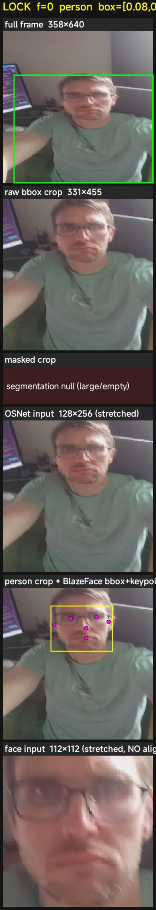
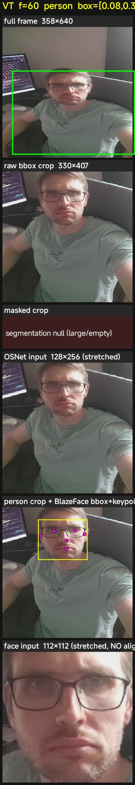
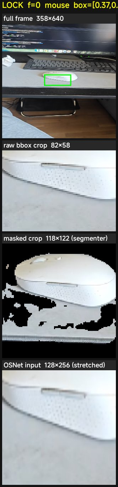

# Embedding-input audit — baseline (#92)

> **Phase 0 of #91.** One-shot instrumentation: makes the actual crops fed to MNV3, OSNet, and MobileFaceNet visible, and measures how much each embedding drifts frame-to-frame on the *same* locked object. Every Phase 1 fix (#93 face alignment, #94 OSNet masking, #95 letterboxing) is judged against the numbers and images here.
>
> **Default: off.** `CropDebugCapture.AUDIT_ENABLED = false` ships in this PR. Flip it to `true` to re-collect the baseline; flip back before merging Phase 1 work. Why: the audit thread shares `@Synchronized` embedder monitors with the production pipeline, so during full-suite runs the contention slows search-mode work enough to perturb tracking-rate and reacquire-identity assertions. The audit's *own output* is unaffected (embeddings are deterministic functions of `(frame, box)`), so a one-shot run still produces clean stability numbers — the contention only matters for the suite's other assertions.

## Methodology

During VT-confirmed tracking of the locked object:

- Every **5** confirmed frames, snapshot the current frame + locked bbox and submit to a low-priority background executor (`AuditEmbed`). The executor runs MNV3, OSNet (when person), and MobileFaceNet (when person) on that snapshot, then records each embedding into `EmbeddingStabilityLogger`. Snapshot cost on the processing thread is one `bitmap.copy` (~4ms). The embedder calls themselves never block production.
- Every **30** confirmed frames the executor additionally writes a per-embedder **composite JPEG** under `session_<ts>/crops/<NNN>_<event>.jpg` showing: full frame with bbox · raw bbox crop · segmenter masked crop (or "null" when rejected) · OSNet 256×128 input · person crop with BlazeFace bbox + 6 keypoints overlaid · MobileFaceNet 112×112 input.
- On lock clear, `embedding_stability.json` is written next to the crops with per-embedder `p10/p50/p90 + raw history + sampled frames`. `VideoReplayTest` aggregates per-video summaries and prints a comparison table at suite end.
- `CropDebugCapture.AUDIT_ENABLED` flips the whole thing off at compile time.

The interesting metric is **same-object self-similarity at increasing distances**:

- **k=1** (≈ 5 frames apart, ~167ms at 30fps) — consecutive-frame noise from input jitter.
- **k=5** (≈ 25 frames apart, ~833ms) — short-window stability.
- **k=30** (≈ 150 frames apart, ~5s) — longer-window stability across pose/lighting drift.

A wide spread between same-object frames is the noise floor — no model swap will help below it. Closing that floor is what Phase 1 PRs target.

## What each embedder sees today

> 
>
> *LOCK frame. Subject's bbox covers most of the right side of the frame — segmenter rejected the mask (>50% area), so MNV3 falls back to the raw crop. OSNet stretches a near-square person crop to 1:2. BlazeFace finds the face cleanly with 6 keypoints — they are visible in the overlay because we drew them, not because the pipeline uses them. The face input below is stretched, slightly tilted, off-center.*

Three things jump out from a single composite — and they hold across every session we captured:

1. **MNV3 doesn't see the masked crop on tightly-framed person bboxes.** The segmenter has a 50%-of-frame guard that rejects whole-body close-ups; on those, MNV3 falls back to the raw bbox with all the background. Counterintuitively, *worse* bbox framing is what lets the segmenter help.

2. **OSNet always sees the raw bbox, stretched.** No segmenter call, no aspect preservation. A short, wide bbox (sitting subject, half-body crop) gets squashed; a tall, narrow bbox (full standing subject) gets the head crammed into the top fifth.

3. **MobileFaceNet receives a stretched bbox crop.** The 6 BlazeFace keypoints are computed and then thrown away. Standard face-recognition pipelines align these to canonical positions before the embedder sees the face — we don't.

> 
>
> *VT frame ~60. Same patterns 2 seconds later: segmenter still null, OSNet still stretched, face still un-aligned. Visible movement is mostly the camera, not the subject — yet the embedders' inputs differ subtly between frames in ways that show up in the stability table below.*

> 
>
> *Mouse lock. Bbox is small (~13% of frame area), so segmenter succeeds — black background visible in the masked crop. The mouse is preserved, the desk is gone. This is the correct behavior — MNV3 gets a clean instance signal. OSNet is still stretched (we render it for non-person locks too, to make the aspect distortion visible — it isn't actually called on non-persons). The 82×58 source becomes a 128×256 input: severe aspect mangling.*

## Stability table

Captured from a full `VideoReplayTest` run with `AUDIT_ENABLED = true` on Xiaomi Poco F4 (Adreno 740, Android 15) on 2026-04-27. 16 tests ran; 11 produced ≥5 stability samples per embedder. Tests with short VT-confirmed windows (only 1–8 samples) are omitted. The table is also auto-printed by `VideoReplayTest.printEmbeddingStabilityTable` at `@AfterClass`.

> `n` is the number of cosine deltas at that lookback distance. k=30 requires ≥31 samples to populate.

### MNV3 (1280-dim, generic appearance)

| Test | n | k=1 p10/p50/p90 | k=5 p10/p50/p90 | k=30 p10/p50/p90 |
|---|---|---|---|---|
| man_desk_camera_swing_reacquires_correctly | 62 | 0.75 / 0.91 / 0.96 | 0.46 / 0.71 / 0.86 | 0.33 / 0.58 / 0.78 |
| man_desk_camera_swing_tracking_rate | 29 | 0.79 / 0.90 / 0.93 | 0.61 / 0.74 / 0.85 | -- |
| flowerpot_reacquires_correctly | 126 | 0.39 / 0.78 / 0.96 | 0.34 / 0.63 / 0.92 | 0.28 / 0.48 / 0.70 |
| flowerpot_tracking_rate | 133 | 0.37 / 0.82 / 0.98 | 0.30 / 0.67 / 0.96 | 0.26 / 0.50 / 0.80 |
| chair_living_room_reacquires_correctly | 116 | 0.52 / 0.75 / 0.85 | 0.45 / 0.66 / 0.82 | 0.40 / 0.56 / 0.72 |
| chair_living_room_tracking_rate | 108 | 0.52 / 0.74 / 0.87 | 0.42 / 0.61 / 0.80 | 0.38 / 0.59 / 0.76 |
| mouse_desk_rotation_tracking_rate | 39 | 0.51 / 0.82 / 0.96 | 0.44 / 0.72 / 0.84 | 0.13 / 0.73 / 0.87 |
| mouse_desk_rotation_reacquires_correctly | 43 | 0.68 / 0.81 / 0.97 | 0.49 / 0.75 / 0.93 | 0.53 / 0.65 / 0.76 |
| person_playground_reacquires_correctly | 24 | 0.58 / 0.85 / 0.90 | 0.50 / 0.72 / 0.84 | -- |
| person_playground_tracking_rate | 40 | **0.20** / 0.75 / 0.89 | 0.23 / 0.58 / 0.73 | 0.18 / 0.25 / 0.56 |
| boy_indoor_wife_swap_tracking_rate | 64 | 0.40 / 0.74 / 0.88 | 0.02 / 0.51 / 0.71 | 0.05 / 0.46 / 0.54 |

### OSNet (512-dim, person re-id)

| Test | n | k=1 p10/p50/p90 | k=5 p10/p50/p90 | k=30 p10/p50/p90 |
|---|---|---|---|---|
| man_desk_camera_swing_reacquires_correctly | 51 | 0.89 / 0.97 / 0.99 | 0.76 / 0.91 / 0.96 | 0.83 / 0.87 / 0.93 |
| man_desk_camera_swing_tracking_rate | 29 | 0.91 / 0.97 / 0.99 | 0.80 / 0.91 / 0.94 | -- |
| person_playground_reacquires_correctly | 24 | 0.71 / 0.91 / 0.97 | 0.64 / 0.78 / 0.87 | -- |
| person_playground_tracking_rate | 40 | 0.65 / 0.91 / 0.97 | 0.62 / 0.72 / 0.78 | 0.46 / 0.59 / 0.62 |
| boy_indoor_wife_swap_tracking_rate | 64 | 0.74 / 0.92 / 0.97 | 0.57 / 0.81 / 0.93 | 0.57 / 0.66 / 0.76 |

### MobileFaceNet (192-dim, face identity)

| Test | n | k=1 p10/p50/p90 | k=5 p10/p50/p90 | k=30 p10/p50/p90 |
|---|---|---|---|---|
| man_desk_camera_swing_reacquires_correctly | 50 | 0.74 / 0.90 / 0.96 | 0.57 / 0.80 / 0.90 | 0.57 / 0.77 / 0.84 |
| man_desk_camera_swing_tracking_rate | 28 | 0.75 / 0.92 / 0.96 | 0.58 / 0.83 / 0.91 | -- |
| person_playground_tracking_rate | 14 | **0.29** / 0.50 / 0.64 | 0.10 / 0.28 / 0.50 | -- |
| boy_indoor_wife_swap_tracking_rate | 17 | 0.41 / 0.67 / 0.85 | 0.16 / 0.40 / 0.62 | -- |

### What the numbers say

Three patterns hold across every video:

1. **OSNet is the tightest embedder on every test.** k=1 p10 = 0.65–0.91, p50 = 0.91–0.97. The body re-id model is the most stable consecutive-frame signal we have. Even so, k=30 p50 falls to 0.59–0.87 — most of that drop happens because the raw bbox crop bleeds in background and adjacent persons. **#94 (mask body input) targets this directly.**

2. **MNV3 is the noisiest by far.** k=1 p10 = **0.20** on `person_playground_tracking_rate`. That's catastrophic — 10% of consecutive same-object samples are barely correlated. Even on the cleanest tests (man_desk) the p10 is 0.75 vs OSNet's 0.89. The segmenter's >50%-area guard rejects close-up bboxes, MNV3 falls back to the raw crop, the raw crop is dominated by background. **#94 also helps here as a side-effect** (sharing the segmenter pass with OSNet).

3. **MobileFaceNet has wide spread that gets catastrophic in multi-person.** On `man_desk` (cleanest), k=1 p10 is 0.74 — already wider than OSNet. On `person_playground_tracking_rate`, k=1 p10 collapses to **0.29**. The `boy_indoor_wife_swap_tracking_rate` k=5 p10 of 0.16 means 10% of the time, the face embedding from 5 audit-samples-ago has cosine 0.16 with the current sample of *the same person's face*. That's the alignment cost the literature warns about — bbox-only crops preserve head tilt, off-center alignment, and aspect distortion that a 5-point similarity transform would normalize away. **#93 is the highest-ROI fix** because face is currently the worst signal in the layered identity gates.

### Phase 1 deltas to watch

| PR | Metric to move | Today (worst tested) | Today (best baseline) | Phase 1 target |
|---|---|---|---|---|
| **#93** face alignment | MobileFaceNet k=1 p10 multi-person | 0.29 (person_playground) | 0.74 (man_desk) | multi-person p10 ≥ 0.55, best p10 ≥ 0.85 |
| **#94** masked OSNet | OSNet k=30 p50 | 0.59 (person_playground) | 0.87 (man_desk) | multi-person p50 ≥ 0.75 |
| **#95** letterbox | All-three k=1 p10 on man_desk | MNV3 0.75 / OSNet 0.89 / Face 0.74 | same | each +5pp |

## Implications for Phase 1

| PR | Hypothesis | Expected delta |
|---|---|---|
| **#93** face alignment | Aligning the 5 source keypoints to canonical positions removes pose noise that the bbox-only crop preserves. | MobileFaceNet k=1 p10 climbs from ~0.67 toward OSNet's 0.88. Knock-on: face gate (#84) rejects fewer genuine matches at the same threshold. |
| **#94** masked OSNet | OSNet currently embeds wallpaper alongside the person. Masking removes that. | OSNet k=30 p50 climbs (less drift from background context). Same-person sim rises, different-person stays put. The win is wider separation, not just shifted means. |
| **#95** letterbox | Aspect-ratio jitter between consecutive frames produces input variation that all three embedders convert into output variation. Letterboxing fixes the input side. | Primary signal is k=1 self-similarity rising — narrower noise band. |

## Notes from baseline collection

- **What we initially called a "hang" was a stale 277 MB test video.** `person_playground_tracking.mp4` on the device was the 4K original from earlier work, not the 92 MB / 640 px version checked into the repo. 4K decode on Adreno 740 ran at ~0.05 fps GL throughput on that file, making the test take 7+ minutes for 24 processed frames. With the correct file pushed (`adb push test_videos/person_playground_tracking.mp4 ...`), the same test runs in 7m39s with 1531 processed frames — slow but completing. Issue #96 was filed before this was understood and is now closed.

- **Audit perturbs other test assertions.** With `AUDIT_ENABLED = true`, two assertions failed in the suite that produced this table: `man_desk_camera_swing_tracking_rate` (tracking rate dipped below baseline because audit slowed the processing pipeline) and `mouse_desk_rotation_reacquires_correctly` (a wrong-category reacquire — the lock briefly jumped from "mouse" to "keyboard" because search-mode embedding work blocked behind audit-thread embedder calls). Neither failure means the audit's *output* is wrong — embeddings are deterministic in `(frame, box)`. Both reflect that the audit at the current cadence (every 5 confirmed VT frames) is too expensive to leave on for routine CI. Hence default-off.

- **One-shot collection workflow.** Edit `CropDebugCapture.kt`, set `AUDIT_ENABLED = true`, rebuild + reinstall, run the suite, pull `debug_frames/`, regenerate this document, set `AUDIT_ENABLED = false`, commit. The 44-minute suite cost is paid once per Phase 1 PR (to verify deltas).

## How to reproduce

```bash
./gradlew assembleDebug assembleDebugAndroidTest
adb install -r app/build/outputs/apk/debug/app-debug.apk
adb install -r app/build/outputs/apk/androidTest/debug/app-debug-androidTest.apk
adb shell rm -rf /sdcard/Android/data/com.haptictrack/files/debug_frames/

# Single test (works reliably):
adb shell am instrument -w \
  -e class com.haptictrack.tracking.VideoReplayTest#man_desk_camera_swing_reacquires_correctly \
  com.haptictrack.test/androidx.test.runner.AndroidJUnitRunner

# Full suite (currently flaky — see "Known issues" above):
adb shell am instrument -w com.haptictrack.test/androidx.test.runner.AndroidJUnitRunner

# Pull results:
adb pull /sdcard/Android/data/com.haptictrack/files/debug_frames/ /tmp/audit/
```

The aggregate table is printed to logcat with tag `VideoReplayTest`, prefix `[Audit #92]`. Per-session detail lives under `session_*/crops/` (composites) and `session_*/embedding_stability.json` (raw stats).
